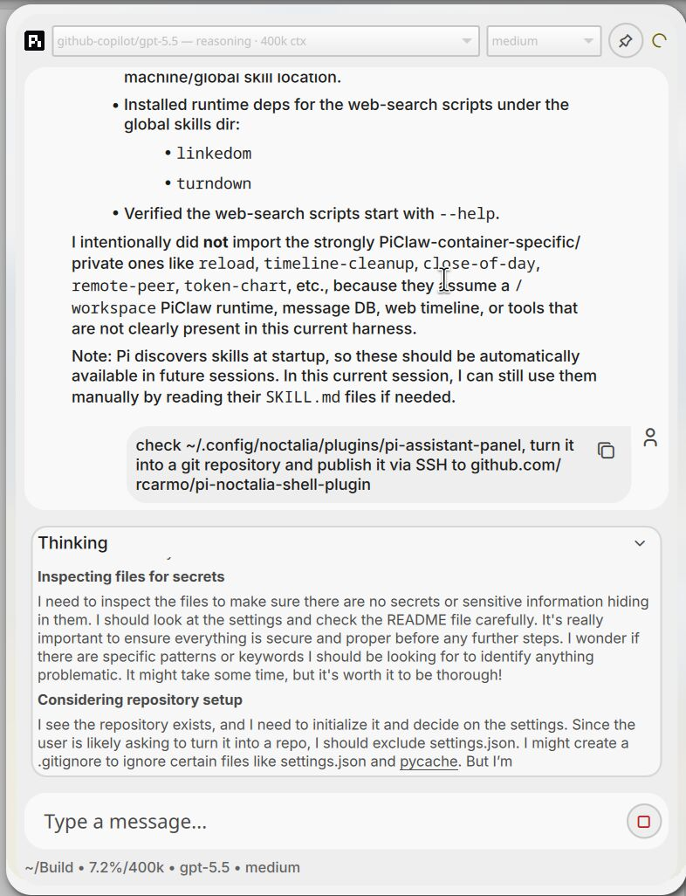

# pi-assistant-panel

Noctalia assistant panel backed by the Pi coding assistant over `pi --mode rpc`, inspired by the UX I created for [`piclaw`](https://github.com/rcarmo/piclaw).

## Notes

- The plugin starts a small Python bridge daemon in the background.
- The bridge launches `pi --mode rpc` and exposes a local Unix socket to the QML UI.
- By default the plugin runs Pi with `--no-tools` for a safer chat-like mode.
- Pi is started in `~/Build` when that directory exists, otherwise in your home directory.
- You can switch to read-only or full tools from the plugin settings.

## Requirements

- `python3`
- `pi` in `PATH` (or set a custom command in settings)
- a Pi model configured via Pi itself (`pi`, `/login`, `/model`) or via environment/API-key setup
